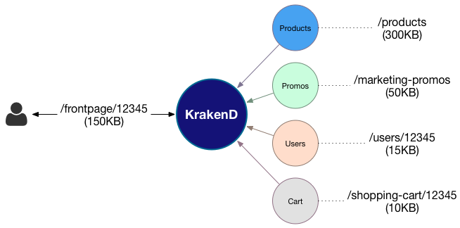

# KrakenD
Consumers of REST API content (specially in microservices) often query backend services that weren't coded for the UI implementation. This is of course a good practice, but the UI consumers need to do implementations that suffer a lot of complexity and burden with the sizes of their microservices responses.

KrakenD is an **API Gateway** builder and proxy generator that sits between the client and all the source servers, adding a new layer that removes all the complexity to the clients, providing them only the information that the UI needs. KrakenD acts as an **aggregator** of many sources into single endpoints and allows you to group, wrap, transform and shrink responses. Additionally it supports a myriad of middelwares and plugins that allow you to extend the functionality, such as adding Oauth authorization or security layers (SSL, certificates, HTTP Strict Transport Security, Clickjacking protection, HTTP Public Key Pinning, MIME-sniffing prevention, XSS protection).

KrakenD not only supports HTTP(S), but because it is a set of generic libraries you can build all type of API Gateways and proxies, including for instance, a RPC gateway.

#### Practical Example
Fred Calamari is a mobile developer that needs to construct a single front page that requires data from several calls to their backend services, e.g:

    1) api.store.server/products
    2) api.store.server/marketing-promos
    3) api.users.server/users/{id_user}
    4) api.users.server/shopping-cart/{id_user}

The screen is very simple and _only_ needs to retrieve data from 4 different sources, wait for the round trip and then pick only a few fields of the response. Instead of thing these calls, the mobile could call a single endpoint to KrakenD:
 
    1) krakend.server/frontpage/{id_user}

And this is how it would look like:

The difference in size in this example would be because KrakenD server would have removed unneeded attributes from the responses.
 

## What's in this repository?
The source code on which the [KrakenD](http://devops.faith/krakend) service core is built on. It is designed to work with your own middleware and extend the functionality by using small, independent, reusable components following the Unix philosophy. 
 
**This repository is only for those who want to build from source a Krakend service** or for those who will reuse any of the components in another application.

If you just want to use the server, please [download the binary for your architecture](http://devops.faith/krakend/download).

## Library Usage
Krakend is presented as a **go library** that you can include in your own go application to build a powerful proxy or API gateway. In order to get you started several examples of implementations are included in the `examples` folder.
 
Of course you will need [go installed](https://golang.org/doc/install) in your system to compile the code.
There is a `Makefile` in the folder `examples/gin` that will download library dependencies and compile a binary for you to test. Just run:

    cd examples/gin
    make

## Configuration file
The configuration file needs to be a `json` file. 

Please check that the structure follows the [expected criteria](http://devops.faith/krakend/docs/configuration-syntax).

### Json example

    {
        "version": 1,
        "name": "My lovely gateway",
        "port": 8080,
        "timeout": 10,
        "cache_ttl": 3600,
        "host": [
            "http://127.0.0.1:8080",
            "http://127.0.0.2:8000",
            "http://127.0.0.3:9000",
            "http://127.0.0.4"
        ],
        "endpoints": [
            {
                "endpoint": "/users/{user}",
                "method": "GET",
                "backend": [
                    {
                        "host": [
                            "http://127.0.0.3:9000",
                            "http://127.0.0.4"
                        ],
                        "url_pattern": "/registered/{user}",
                        "whitelist": [
                            "some",
                            "what"
                        ]
                        "mapping": {
                            "email": "personal_email"
                        }
                    },
                    {
                        "host": [
                            "http://127.0.0.1:8080"
                        ],
                        "url_pattern": "/users/{user}/permissions",
                        "blacklist": [
                            "spam2",
                            "notwanted2"
                        ]
                    }
                ],
                "concurrent_calls": 2,
                "timeout": 1000,
                "cache_ttl": 3600,
                "querystring_params": [
                    "page",
                    "limit"
                ]
            },
            {
                "endpoint": "/foo/bar",
                "method": "POST",
                "backend": [
                    {
                        "host": [
                            "https://127.0.0.1:8081"
                        ],
                        "url_pattern": "/__debug/tupu"
                    }
                ],
                "concurrent_calls": 1,
                "timeout": 10000,
                "cache_ttl": 3600,
            },
            {
                "endpoint": "/github",
                "method": "GET",
                "backend": [
                    {
                        "host": [
                            "https://api.github.com"
                        ],
                        "url_pattern": "/",
                        "whitelist": [
                            "authorizations_url",
                            "code_search_url"
                        ]
                    }
                ],
                "concurrent_calls": 2,
                "timeout": 1000,
                "cache_ttl": 3600,
            },
            {
                "endpoint": "/combination/{id}/{supu}",
                "method": "GET",
                "backend": [
                    {
                        "group": "first_post",
                        "host": [
                            "https://jsonplaceholder.typicode.com"
                        ],
                        "url_pattern": "/posts/{id}?supu={supu}",
                        "blacklist": [
                            "userId"
                        ]
                    },
                    {
                        "host": [
                            "https://jsonplaceholder.typicode.com"
                        ],
                        "url_pattern": "/users/{id}",
                        "mapping": {
                            "email": "personal_email"
                        }
                    }
                ],
                "concurrent_calls": 3,
                "timeout": 4000,
                "querystring_params": [
                    "page",
                    "limit"
                ]
            }
        ]
    }
 

## Benchmarks

Router middlewares

    BenchmarkNewLoadBalancedProxyMw-8                    1000000          1361 ns/op
    BenchmarkNewConcurrentProxyMw_singleNext-8            300000          6243 ns/op
    BenchmarkNewMergeDataProxyMw-8                        200000         11835 ns/op
    BenchmarkNewRequestBuilderProxyMw-8                   500000          4939 ns/op

Response property whitelisting

    BenchmarkEntityFormatter_whitelistingFilter/with_0_elements_with_0_extra_fields-8           100000000           21.5 ns/op
    BenchmarkEntityFormatter_whitelistingFilter/with_1_elements_with_0_extra_fields-8            2000000           658 ns/op
    BenchmarkEntityFormatter_whitelistingFilter/with_2_elements_with_0_extra_fields-8            2000000           690 ns/op
    BenchmarkEntityFormatter_whitelistingFilter/with_3_elements_with_0_extra_fields-8            2000000           739 ns/op
    BenchmarkEntityFormatter_whitelistingFilter/with_4_elements_with_0_extra_fields-8            2000000           740 ns/op
    BenchmarkEntityFormatter_whitelistingFilter/with_0_elements_with_5_extra_fields-8           100000000           19.0 ns/op
    BenchmarkEntityFormatter_whitelistingFilter/with_1_elements_with_5_extra_fields-8            2000000           730 ns/op
    BenchmarkEntityFormatter_whitelistingFilter/with_2_elements_with_5_extra_fields-8            2000000           888 ns/op
    BenchmarkEntityFormatter_whitelistingFilter/with_3_elements_with_5_extra_fields-8            2000000           917 ns/op
    BenchmarkEntityFormatter_whitelistingFilter/with_4_elements_with_5_extra_fields-8            2000000           881 ns/op
    BenchmarkEntityFormatter_whitelistingFilter/with_0_elements_with_10_extra_fields-8          100000000           19.2 ns/op
    BenchmarkEntityFormatter_whitelistingFilter/with_1_elements_with_10_extra_fields-8           2000000           997 ns/op
    BenchmarkEntityFormatter_whitelistingFilter/with_2_elements_with_10_extra_fields-8           1000000          1053 ns/op
    BenchmarkEntityFormatter_whitelistingFilter/with_3_elements_with_10_extra_fields-8           1000000          1079 ns/op
    BenchmarkEntityFormatter_whitelistingFilter/with_4_elements_with_10_extra_fields-8           1000000          1065 ns/op
    BenchmarkEntityFormatter_whitelistingFilter/with_0_elements_with_15_extra_fields-8          100000000           22.0 ns/op
    BenchmarkEntityFormatter_whitelistingFilter/with_1_elements_with_15_extra_fields-8           1000000          1046 ns/op
    BenchmarkEntityFormatter_whitelistingFilter/with_2_elements_with_15_extra_fields-8           1000000          1064 ns/op
    BenchmarkEntityFormatter_whitelistingFilter/with_3_elements_with_15_extra_fields-8           1000000          1288 ns/op
    BenchmarkEntityFormatter_whitelistingFilter/with_4_elements_with_15_extra_fields-8           1000000          1230 ns/op
    BenchmarkEntityFormatter_whitelistingFilter/with_0_elements_with_20_extra_fields-8          100000000           19.0 ns/op
    BenchmarkEntityFormatter_whitelistingFilter/with_1_elements_with_20_extra_fields-8           1000000          1164 ns/op
    BenchmarkEntityFormatter_whitelistingFilter/with_2_elements_with_20_extra_fields-8           1000000          1256 ns/op
    BenchmarkEntityFormatter_whitelistingFilter/with_3_elements_with_20_extra_fields-8           1000000          1397 ns/op
    BenchmarkEntityFormatter_whitelistingFilter/with_4_elements_with_20_extra_fields-8           1000000          1316 ns/op
    BenchmarkEntityFormatter_whitelistingFilter/with_0_elements_with_25_extra_fields-8          100000000           18.8 ns/op
    BenchmarkEntityFormatter_whitelistingFilter/with_1_elements_with_25_extra_fields-8           1000000          1388 ns/op
    BenchmarkEntityFormatter_whitelistingFilter/with_2_elements_with_25_extra_fields-8           1000000          1593 ns/op
    BenchmarkEntityFormatter_whitelistingFilter/with_3_elements_with_25_extra_fields-8           1000000          1619 ns/op
    BenchmarkEntityFormatter_whitelistingFilter/with_4_elements_with_25_extra_fields-8           1000000          1693 ns/op

Response property blacklisting

    BenchmarkEntityFormatter_blacklistingFilter/with_0_elements_with_0_extra_fields-8           50000000            21.6 ns/op
    BenchmarkEntityFormatter_blacklistingFilter/with_1_elements_with_0_extra_fields-8           30000000            45.9 ns/op
    BenchmarkEntityFormatter_blacklistingFilter/with_2_elements_with_0_extra_fields-8           20000000            70.3 ns/op
    BenchmarkEntityFormatter_blacklistingFilter/with_3_elements_with_0_extra_fields-8           50000000            28.4 ns/op
    BenchmarkEntityFormatter_blacklistingFilter/with_4_elements_with_0_extra_fields-8           50000000            31.8 ns/op
    BenchmarkEntityFormatter_blacklistingFilter/with_0_elements_with_5_extra_fields-8           100000000           19.6 ns/op
    BenchmarkEntityFormatter_blacklistingFilter/with_1_elements_with_5_extra_fields-8           30000000            44.4 ns/op
    BenchmarkEntityFormatter_blacklistingFilter/with_2_elements_with_5_extra_fields-8           20000000            69.2 ns/op
    BenchmarkEntityFormatter_blacklistingFilter/with_3_elements_with_5_extra_fields-8           20000000            95.1 ns/op
    BenchmarkEntityFormatter_blacklistingFilter/with_4_elements_with_5_extra_fields-8           10000000           138 ns/op
    BenchmarkEntityFormatter_blacklistingFilter/with_0_elements_with_10_extra_fields-8          100000000           19.2 ns/op
    BenchmarkEntityFormatter_blacklistingFilter/with_1_elements_with_10_extra_fields-8          30000000            43.3 ns/op
    BenchmarkEntityFormatter_blacklistingFilter/with_2_elements_with_10_extra_fields-8          20000000            71.5 ns/op
    BenchmarkEntityFormatter_blacklistingFilter/with_3_elements_with_10_extra_fields-8          20000000            95.2 ns/op
    BenchmarkEntityFormatter_blacklistingFilter/with_4_elements_with_10_extra_fields-8          10000000           118 ns/op
    BenchmarkEntityFormatter_blacklistingFilter/with_0_elements_with_15_extra_fields-8          100000000           19.1 ns/op
    BenchmarkEntityFormatter_blacklistingFilter/with_1_elements_with_15_extra_fields-8          30000000            42.0 ns/op
    BenchmarkEntityFormatter_blacklistingFilter/with_2_elements_with_15_extra_fields-8          20000000            68.2 ns/op
    BenchmarkEntityFormatter_blacklistingFilter/with_3_elements_with_15_extra_fields-8          20000000            95.7 ns/op
    BenchmarkEntityFormatter_blacklistingFilter/with_4_elements_with_15_extra_fields-8          10000000           116 ns/op
    BenchmarkEntityFormatter_blacklistingFilter/with_0_elements_with_20_extra_fields-8          100000000           18.9 ns/op
    BenchmarkEntityFormatter_blacklistingFilter/with_1_elements_with_20_extra_fields-8          30000000            43.8 ns/op
    BenchmarkEntityFormatter_blacklistingFilter/with_2_elements_with_20_extra_fields-8          20000000            66.7 ns/op
    BenchmarkEntityFormatter_blacklistingFilter/with_3_elements_with_20_extra_fields-8          20000000            94.2 ns/op
    BenchmarkEntityFormatter_blacklistingFilter/with_4_elements_with_20_extra_fields-8          10000000           120 ns/op
    BenchmarkEntityFormatter_blacklistingFilter/with_0_elements_with_25_extra_fields-8          100000000           18.9 ns/op
    BenchmarkEntityFormatter_blacklistingFilter/with_1_elements_with_25_extra_fields-8          30000000            42.7 ns/op
    BenchmarkEntityFormatter_blacklistingFilter/with_2_elements_with_25_extra_fields-8          20000000            70.0 ns/op
    BenchmarkEntityFormatter_blacklistingFilter/with_3_elements_with_25_extra_fields-8          20000000            93.2 ns/op
    BenchmarkEntityFormatter_blacklistingFilter/with_4_elements_with_25_extra_fields-8          20000000           119 ns/op

Response property groupping

    BenchmarkEntityFormatter_grouping/with_0_elements-8                            3000000           515 ns/op
    BenchmarkEntityFormatter_grouping/with_5_elements-8                            3000000           530 ns/op
    BenchmarkEntityFormatter_grouping/with_10_elements-8                           3000000           527 ns/op
    BenchmarkEntityFormatter_grouping/with_15_elements-8                           3000000           520 ns/op
    BenchmarkEntityFormatter_grouping/with_20_elements-8                           3000000           524 ns/op
    BenchmarkEntityFormatter_grouping/with_25_elements-8                           3000000           518 ns/op

Repsonse property mapping

    BenchmarkEntityFormatter_mapping/with_0_elements_with_0_extra_fields-8        100000000           19.3 ns/op
    BenchmarkEntityFormatter_mapping/with_1_elements_with_0_extra_fields-8        20000000            69.3 ns/op
    BenchmarkEntityFormatter_mapping/with_2_elements_with_0_extra_fields-8        20000000            82.9 ns/op
    BenchmarkEntityFormatter_mapping/with_3_elements_with_0_extra_fields-8        20000000            93.5 ns/op
    BenchmarkEntityFormatter_mapping/with_4_elements_with_0_extra_fields-8        20000000           106 ns/op
    BenchmarkEntityFormatter_mapping/with_5_elements_with_0_extra_fields-8        10000000           120 ns/op
    BenchmarkEntityFormatter_mapping/with_0_elements_with_5_extra_fields-8        100000000           22.0 ns/op
    BenchmarkEntityFormatter_mapping/with_1_elements_with_5_extra_fields-8        20000000           116 ns/op
    BenchmarkEntityFormatter_mapping/with_2_elements_with_5_extra_fields-8        10000000           155 ns/op
    BenchmarkEntityFormatter_mapping/with_3_elements_with_5_extra_fields-8        10000000           172 ns/op
    BenchmarkEntityFormatter_mapping/with_4_elements_with_5_extra_fields-8         5000000           201 ns/op
    BenchmarkEntityFormatter_mapping/with_5_elements_with_5_extra_fields-8         5000000           226 ns/op
    BenchmarkEntityFormatter_mapping/with_0_elements_with_10_extra_fields-8       100000000           20.9 ns/op
    BenchmarkEntityFormatter_mapping/with_1_elements_with_10_extra_fields-8       20000000            92.6 ns/op
    BenchmarkEntityFormatter_mapping/with_2_elements_with_10_extra_fields-8       10000000           121 ns/op
    BenchmarkEntityFormatter_mapping/with_3_elements_with_10_extra_fields-8       10000000           167 ns/op
    BenchmarkEntityFormatter_mapping/with_4_elements_with_10_extra_fields-8       10000000           204 ns/op
    BenchmarkEntityFormatter_mapping/with_5_elements_with_10_extra_fields-8        5000000           283 ns/op
    BenchmarkEntityFormatter_mapping/with_0_elements_with_15_extra_fields-8       100000000           19.9 ns/op
    BenchmarkEntityFormatter_mapping/with_1_elements_with_15_extra_fields-8       20000000           100 ns/op
    BenchmarkEntityFormatter_mapping/with_2_elements_with_15_extra_fields-8       10000000           149 ns/op
    BenchmarkEntityFormatter_mapping/with_3_elements_with_15_extra_fields-8       10000000           163 ns/op
    BenchmarkEntityFormatter_mapping/with_4_elements_with_15_extra_fields-8       10000000           202 ns/op
    BenchmarkEntityFormatter_mapping/with_5_elements_with_15_extra_fields-8        5000000           247 ns/op
    BenchmarkEntityFormatter_mapping/with_0_elements_with_20_extra_fields-8       100000000           19.2 ns/op
    BenchmarkEntityFormatter_mapping/with_1_elements_with_20_extra_fields-8       20000000            89.6 ns/op
    BenchmarkEntityFormatter_mapping/with_2_elements_with_20_extra_fields-8       10000000           128 ns/op
    BenchmarkEntityFormatter_mapping/with_3_elements_with_20_extra_fields-8       10000000           169 ns/op
    BenchmarkEntityFormatter_mapping/with_4_elements_with_20_extra_fields-8        5000000           242 ns/op
    BenchmarkEntityFormatter_mapping/with_5_elements_with_20_extra_fields-8        5000000           299 ns/op
    BenchmarkEntityFormatter_mapping/with_0_elements_with_25_extra_fields-8       100000000           20.3 ns/op
    BenchmarkEntityFormatter_mapping/with_1_elements_with_25_extra_fields-8       20000000           106 ns/op
    BenchmarkEntityFormatter_mapping/with_2_elements_with_25_extra_fields-8       10000000           147 ns/op
    BenchmarkEntityFormatter_mapping/with_3_elements_with_25_extra_fields-8       10000000           193 ns/op
    BenchmarkEntityFormatter_mapping/with_4_elements_with_25_extra_fields-8        5000000           246 ns/op
    BenchmarkEntityFormatter_mapping/with_5_elements_with_25_extra_fields-8        5000000           269 ns/op

Request generator

    BenchmarkRequestGeneratePath//a-8                                               500000          4363 ns/op
    BenchmarkRequestGeneratePath//a/{{.Supu}}-8                                     300000          6558 ns/op
    BenchmarkRequestGeneratePath//a?b={{.Tupu}}-8                                   200000          7447 ns/op
    BenchmarkRequestGeneratePath//a/{{.Supu}}/foo/{{.Foo}}-8                        200000          9866 ns/op
    BenchmarkRequestGeneratePath//a/{{.Supu}}/foo/{{.Foo}}/b?c={{.Tupu}}-8          100000         13135 ns/op

## Contributing